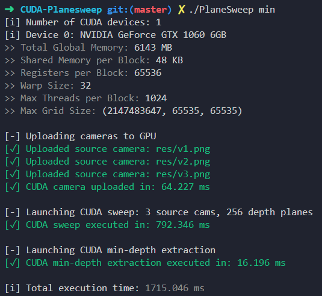

<!-- markdownlint-disable MD033 MD041 MD007 -->

<!-- pretty badges -->
<div align="center">
  
  
  
  
</div>

# ⚡ CUDA Planesweep Project

This project is part of the **INFO-H503 course (ULB)**. It implements an **optimized planesweep kernels** in `CUDA` and benchmarks their performance on your GPU.

Please refer to [**`doc/guidelines.pdf`**](doc/guidelines.pdf) or [**`doc/reportH503.pdf`**](doc/reportH503.pdf) for more info.

<div align="center">
  
  <p align="center"><b>Figure 1</b>: Planesweep with Graph-cut</p>
</div>

## 📜 Features

- **CUDA kernels** for Planesweep algorithm and argmin depth extraction.
- Prints **GPU device info** using CUDA runtime API.
- Benchmarks and pretty colours 🎨✨

## ⚙️ Installation

1. Clone the repository:

    ```sh
    git clone git@github.com:Ant0in/CUDA-Planesweep.git
    cd CUDA-Planesweep
    ```

2. Make sure you have **Cuda installed** and a **Cuda-capable GPU**. Cuda can be installed using `pacman` or `apt`:

    ```sh
    sudo pacman -Syu nvidia nvidia-utils nvidia-settings
    nvidia-smi  # check if you have a cuda-capable gpu
    sudo pacman -S cuda
    ```

You also need to make sure you have **OpenCV** installed. You can use `pacman` or `apt` as well.

3. Build using the provided `Makefile`:

    ```sh
    make  # you can use the clean rule to remove build files
    ```

Alternatively, you can compile it by hand using `nvcc` and `cmake` if you are on **Windows**.

## 🛠️ Usage

To run the **planesweep** algorithm, use:

```sh
./Planesweep min  # or use `gc` if you want to use grap-cut refinement
```

Make sure that **`Planesweep`** is in the same directory as the `/res` directory. Example of **valid** `/res` directory can be found at [**`/res`**](/res/). It includes [**`cam_params.json`**](/res/cam_params.json) and cameras `v_.png` from **`0`** up to **`15`** at max.

<div align="center">
  
  <p align="center"><b>Figure 2</b>: Execution with <b>argmin depth-refinement</b></p>
</div>

## 📄 License

This project is licensed under the **MIT License**. See the [LICENSE](LICENSE) file for more details.

## 🙏 Acknowledgements

This project was developed for the **`GPU Computing`** course **`INFO—H503`**. Special thanks to `Bonatto Daniele (ULB)` and `Soetens Eline (ULB)` for their guidance and support.
